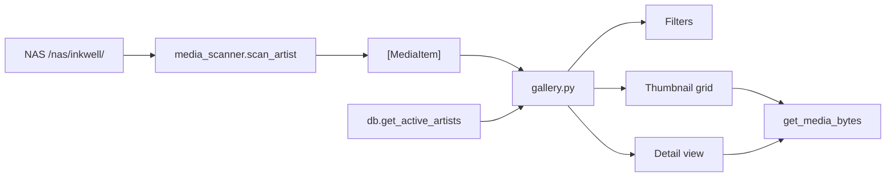

# Gallery Tab: Built-in Media Browser

**Status:** Planned
**Branch:** `feature/gallery-tab` (from `main`)

## Motivation

Inkwell archives art but you can't *see* it from within the tool. You have to leave the dashboard and browse the NAS filesystem to verify downloads or enjoy your archive. A built-in gallery tab closes the loop on the core value proposition.

## Scope

- Images only (jpg, jpeg, png, gif, webp, bmp)
- No video support initially
- Read-only — no tagging, favoriting, or editing

## New Files

### `src/media_scanner.py` — NAS media scanner

Scans the NAS filesystem to discover media for tracked artists. Handles both live directories and zip archives without extraction.

```python
@dataclass
class MediaItem:
    filename: str
    year: str
    size: int
    source: str          # "live" | "zip"
    file_path: Path | None       # for live files
    zip_path: Path | None        # for zipped files
    zip_entry: str | None        # entry name inside zip

IMAGE_EXTS = {".jpg", ".jpeg", ".png", ".gif", ".webp", ".bmp"}

def scan_artist(nas_path: Path, artist_handle: str) -> list[MediaItem]
def scan_years(nas_path: Path, artist_handle: str) -> list[str]
def get_media_bytes(item: MediaItem) -> bytes
```

**How it works:**

- `scan_artist` walks the artist directory: live year dirs via `Path.rglob`, zip files via `zipfile.ZipFile.namelist()`
- `get_media_bytes` reads from filesystem (`path.read_bytes()`) or zip (`zf.read(entry)`) — no temp files, no extraction
- Zip reads are random-access (central directory lookup), not full extraction

### `src/sections/gallery.py` — Gallery tab UI

Streamlit tab with three sections:

1. **Filters** — artist selectbox (from `db.get_active_artists()`), year multiselect (from `scan_years`), sort order (newest/oldest)
2. **Stats bar** — file count and total size for current selection
3. **Thumbnail grid** — 4 columns, paginated at 20 per page. Each cell is `st.image(bytes, use_container_width=True)` + a small `st.button("View", key=...)` that sets `session_state.selected_media`
4. **Detail view** — when an image is selected, show it full-width below the grid with filename, size, year, source (live/zip)

Pagination follows the same pattern as the Artists tab (Prev/Next buttons, page counter).

### `tests/test_media_scanner.py`

Unit tests for `media_scanner.py`:

- Scan live directory with images
- Scan zip archive with images
- Mixed live + zip for same artist (different years)
- `get_media_bytes` returns correct data for both sources
- Non-image files are filtered out
- Empty directories / missing artist returns empty list

## Modified Files

### `src/app.py` — Add Gallery tab

Insert `tab_gallery` between Downloads and Settings tabs:

```python
tab_artists, tab_downloads, tab_gallery, tab_settings, tab_logs = st.tabs(
    ["Artists", "Downloads", "Gallery", "Settings", "Logs"]
)
```

### `docs/ROADMAP.md`

Add and mark gallery tab item as planned/in-progress.

## Data Flow



## Performance Constraints

- Only scan the selected artist (not all artists at once)
- Only call `get_media_bytes` for the current page of thumbnails (~20 images)
- Cache scan results in `st.session_state` keyed by artist handle; invalidate on page load via mtime check
- Zip reads are random-access (central directory lookup), not full extraction

## Implementation Steps

1. Create branch `feature/gallery-tab` from `main`
2. Create `src/media_scanner.py` with scan and read functions
3. Create `tests/test_media_scanner.py` and verify with `pytest`
4. Create `src/sections/gallery.py` with the gallery UI
5. Add Gallery tab to `src/app.py`
6. Update `docs/ROADMAP.md`
7. Run full test suite to confirm nothing breaks
8. Commit

## Future Considerations

- Video support (mp4, webm thumbnails)
- Full-text search across filenames
- Favorite/tag system
- Similarity / dedup detection
- Sharing collections via link
